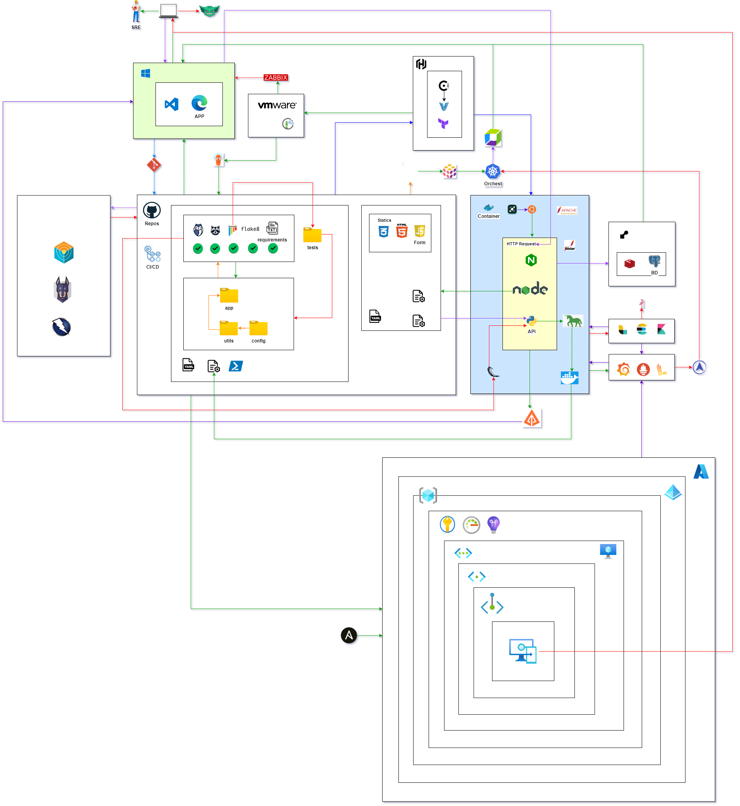

# Architecture Guide

## Contents

- [Architecture Guide](#architecture-guide)
  - [Contents](#contents)
  - [⚙️ System Overview](#️-system-overview)
  - [📊 Diagram](#-diagram)
    - [Components](#components)
  - [🚀 CI/CD Pipeline with Jenkins](#-cicd-pipeline-with-jenkins)
  - [🔐 DevSecOps Best Practices](#-devsecops-best-practices)
    - [🛡️ Key Practices](#️-key-practices)
  - [🛠️ Infrastructure as Code (IaC)](#️-infrastructure-as-code-iac)
  - [🔑 Secret Management](#-secret-management)
  - [✅ Code Review and Approval Gates](#-code-review-and-approval-gates)
  - [🔎 Security Audits](#-security-audits)
  - [📊 CI/CD Pipeline Monitoring](#-cicd-pipeline-monitoring)
  - [📜 Logging](#-logging)
  - [🐳 Docker Versioning](#-docker-versioning)
  - [🎯 General Objectives and Benefits](#-general-objectives-and-benefits)

---

## ⚙️ System Overview

**Target Audience**:
This architecture is designed for development teams leveraging CI/CD pipelines for efficient application deployment, ensuring security and compliance throughout the software development lifecycle.

**Use Case**:
The system automates deployments, integrates security practices, and provides a scalable environment for application development and delivery using Jenkins and other DevOps tools.

**DevSecOps Integration**:
DevSecOps practices ensure that security is embedded at every stage of the pipeline, from development to production, minimizing vulnerabilities and ensuring compliance.

---

## 📊 Diagram

- The diagram illustrates the architecture of the CI/CD pipeline, showcasing how Jenkins interacts with different components for application deployment and monitoring.



- **Jenkins** triggers deployments, builds applications, and integrates with other tools to enforce security and compliance policies.

### Components

1. **Frontend (CI/CD triggers from Jenkins)**: The interface through which users interact with Jenkins, initiating application builds and deployments.

2. **Jenkins Server (Azure VM or Azure DevOps)**: Runs Jenkins in a scalable Azure environment, triggering deployment jobs and interacting with infrastructure components.

3. **Azure Services**: Supports infrastructure scaling and management for application deployment.

---

## 🚀 CI/CD Pipeline with Jenkins

### CI/CD Workflow

To integrate Jenkins with your development workflow, follow these steps:

- **Jenkins on Azure**: Host Jenkins on Azure using **Azure Virtual Machines (VM)** or **Azure DevOps Services**, ensuring the server is accessible for pipeline execution.
- **Automate Deployment**: Configure Jenkins pipelines to automate the build, testing, and deployment processes.
- **Security Integration**: Incorporate security checks into the pipeline to ensure that applications meet compliance requirements before deployment.

**Sample Jenkins Pipeline**:
Here’s an example of a Jenkins pipeline setup:

```groovy
pipeline {
    agent any
    stages {
        stage('Checkout') {
            steps {
                checkout scm
            }
        }
        stage('Build') {
            steps {
                script {
                    sh 'mvn clean install'
                }
            }
        }
        stage('Deploy') {
            steps {
                script {
                    sh './deploy.sh'
                }
            }
        }
        stage('Security Checks') {
            steps {
                script {
                    sh './security-checks.sh'
                }
            }
        }
    }
}
```

---

## 🔐 DevSecOps Best Practices

DevSecOps integrates security practices into every phase of the development lifecycle, ensuring applications remain secure and compliant during deployments. By embedding security into the CI/CD pipeline, this approach ensures vulnerabilities are identified and mitigated early, preventing issues from reaching production.

### 🛡️ Key Practices

#### 1. 🔍 Automated Security Testing

Integrate security tools such as **OWASP ZAP**, **SonarQube**, or **Trivy** into the Jenkins pipeline to perform security scans on both application code and packages before deployment. This ensures that only secure code is deployed, minimizing vulnerabilities.

Example Jenkins Pipeline integration with OWASP ZAP:

```groovy
pipeline {
    agent any
    stages {
        stage('Security Test') {
            steps {
                script {
                    sh 'zap-cli quick-scan --self-contained --url http://your-app-url.com'
                }
            }
        }
    }
}
```

---

## 🛠️ Infrastructure as Code (IaC)

Use **Terraform**, **Azure Resource Manager (ARM)** templates, and **PowerShell** scripts to define and manage infrastructure as code. This approach enables consistent, automated configurations, ensuring environments are securely configured before deployment.

With **IaC**, you can ensure that security configurations are maintained consistently across environments, reducing human error and configuration drift. This approach allows for automated updates, modifications, and enforcement of security policies.

---

## 🔑 Secret Management

Securely manage secrets used in Jenkins configurations (e.g., API keys, passwords) using **Azure Key Vault**, ensuring that sensitive data is protected. **Azure Key Vault** is a cloud service for securely storing and accessing secrets, keys, and certificates. By integrating Azure Key Vault with Jenkins, secrets can be safely retrieved during the deployment process without exposing them in the code or pipeline logs.

Example:

- Store API keys and credentials in Azure Key Vault.
- Access these secrets during Jenkins pipeline execution using **Azure Key Vault Jenkins Plugin**.
- Ensure all sensitive information is encrypted and stored securely, minimizing the risk of exposure.

---

## ✅ Code Review and Approval Gates

Implement code review processes in Jenkins to ensure that security policies and compliance requirements are considered and validated before deployment. Approval gates help prevent insecure or non-compliant code from progressing further in the pipeline.

---

## 🔎 Security Audits

Conduct regular security audits of the CI/CD pipeline, application code, and infrastructure to identify and mitigate vulnerabilities. Use tools like **Audit Logs** and **Static Application Security Testing (SAST)** to ensure compliance.

---

## 📊 CI/CD Pipeline Monitoring

Implement monitoring tools like **Grafana** and **Prometheus** to track the performance and security of your CI/CD pipeline. Monitoring helps identify potential bottlenecks and security issues in real time.

---

## 📜 Logging

Centralize logging for all CI/CD pipeline activities using tools like **ELK Stack**. This approach helps in troubleshooting and auditing pipeline execution.

---

## 🐳 Docker Versioning

Maintain versioning for Docker images used in the pipeline to ensure compatibility and reproducibility. Tag images with meaningful version numbers and store them in a secure Docker registry like **Harbor** or **Azure Container Registry**.

---

## 🎯 General Objectives and Benefits

- **Automation**: Streamline development and deployment processes.
- **Security**: Embed security checks throughout the pipeline.
- **Scalability**: Use cloud-native tools to support infrastructure growth.
- **Compliance**: Ensure all deployments meet industry standards and policies.
